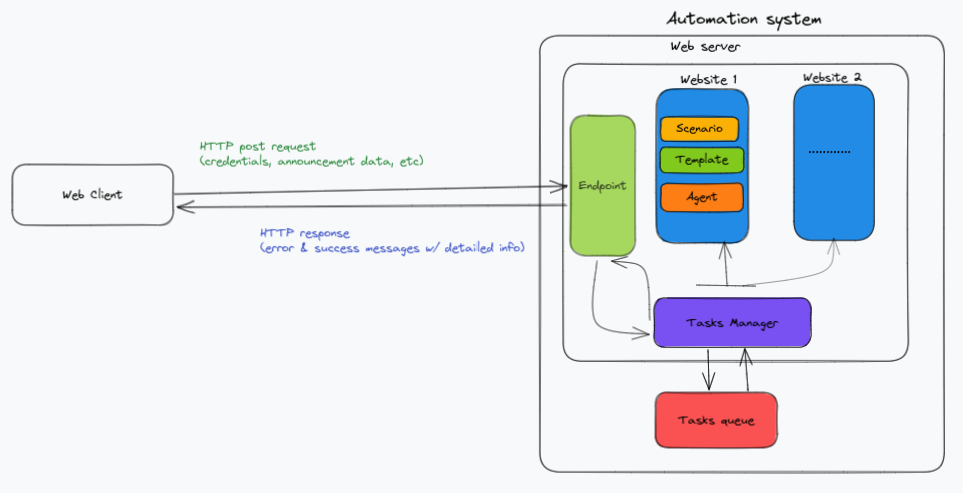

This repo is a hybrid automated scraping system, taken from one of my freelance project (after the clients consent).
It is refactored in order to show only the most crucial parts; 
 
## Architecture

    

## Components

**Tasks Manager**: Orchestrates running Scenarios using a task queue;
 Arranges the run order of scenarios (in sequence, in parallel), 
 and handles  pre/post scenario runs (resources cleanup; notifying Web client with progress, etc)

**Task queue**: Runs jobs sent by the Tasks Manager

**Scenario**: A unit that handles every steps required to achieve the intended objective:
 - extracting data using scraping/received request
 - starting/stopping an agent that interact with a web app

**Agent**: A frontend client to interact with apps
  that dynamically generate their content (Single page apps, etc)

**Templates**: Data formats (form inputs, selection menu dictionaries, etc),
reverse engineered to correctly parse and transfer data to the targeted website 

